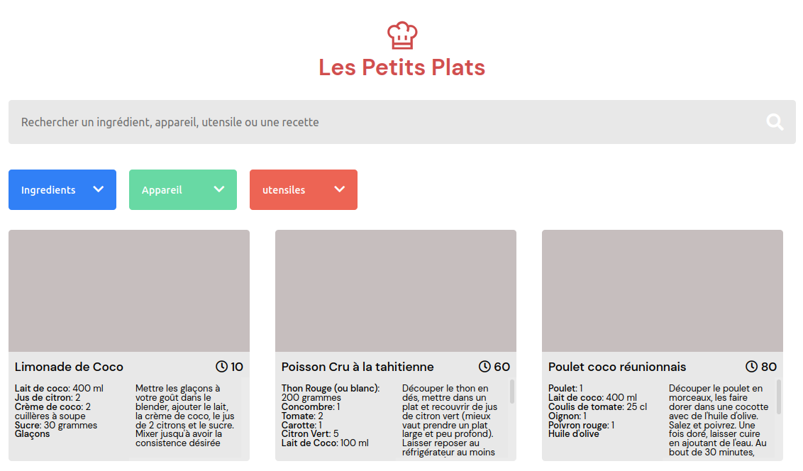

# Les Petits Plats

## Présentation du contexte

**Les Petits Plats** est un site de recettes de cuisine à l’instar de Marmiton ou 750g.
Il propose un moteur de recherche permettant de rechercher les recettes.

## Ce que ce projet m'a permis de pratiquer

### Compétences

* découper et intégrer une maquette,
* structurer une page web avec HTML5,
* mettre en forme une page web avec CSS3,
* manipuler le DOM,
* écouter les évènements,
* générer du contenu dynamiquement depuis un fichier JSON,
* rendre le site accessible,
* élaborer un algorithme de recherche de motif dans un texte,

### Technologies / méthodes

* HTML5 / CSS3,
* positionnement avec Grid et FlexBox,
* responsive design avec les medias queries,
* convention de nommage BEM,
* Fetch / Json,
* CSS avec Sass,
* OOP design,
* MVC pattern,
* référentiel WCAG 2.0.

## Livrables attendus

### Scénario nominal

* Le cas d’utilisation commence lorsque l’utilisateur entre au moins 3 caractères dans la barre de recherche principale,  
* le système recherche des recettes correspondant à l’entrée utilisateur dans : le titre de la recette, la liste des ingrédients de la recette, la description de la recette,
* l’interface est actualisée avec les résultats de recherche,
* les champs de recherche avancée sont actualisés avec les informations ingrédients, ustensiles, appareil des différentes recettes restantes, 
* l’utilisateur précise sa recherche grâce à l’un des champs : ingrédients, ustensiles, appareil,
* au fur et à mesure du remplissage les mots clés ne correspondant pas à la frappe dans le champ disparaissent,
* l’utilisateur choisit un mot clé dans le champ,
* le mot clé apparaît sous forme de tag sous la recherche principale,
* les résultats de recherche sont actualisés, ainsi que les éléments disponibles dans les champs de recherche avancée,
* l’utilisateur sélectionne une recette.

### Scénario alternatif A1

* Aucune recette correspondante à la recherche,
* l'enchaînement A1 commence au point 3 du scénario nominal,
* l’interface affiche « Aucune recette ne correspond à votre critère... vous pouvez chercher « tarte aux pommes », « poisson », etc.

### Scénario alternatif A2

* L’utilisateur commence sa recherche par un tag,
* l'enchaînement A2 commence au point 1 du scénario nominal et reprend au point 9 du scénario nominal,
* l’utilisateur commence la recherche par un tag.
* les résultats de recherche sont actualisés, ainsi que les éléments disponibles dans les champs de recherche avancée (9 du cas principal).

### Scénario alternatif A3

* L’utilisateur ajoute d’autres tags pour la recherche avancée,
* l'enchaînement A3 commence au point 9 du scénario nominal. Cet enchaînement peut se répéter autant que nécessaire,
* l’utilisateur précise sa recherche grâce à l’un des champs : ingrédients, ustensiles, appareil,
* au fur et à mesure du remplissage les mots clés ne correspondant pas à la frappe dans le champ disparaissent,
* l’utilisateur choisit un mot clé dans le champ,
* le mot clé apparaît sous forme de tag sous la recherche principale,
* les résultats de recherche sont actualisés, ainsi que les éléments disponibles dans les champs de recherche avancée.

## Ressources à ma disposition

J'ai disposé des éléments suivants :
* maquette desktop,
* fichier de données Json.

## Consignes

* le code devait être :
    * valide aux normes **W3C**,
    * compatible avec les dernières versions de **Chrome** et **Firefox**
  

